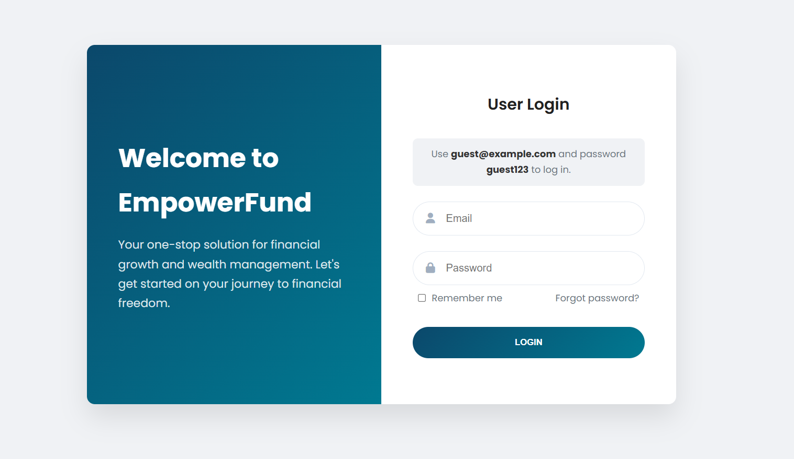
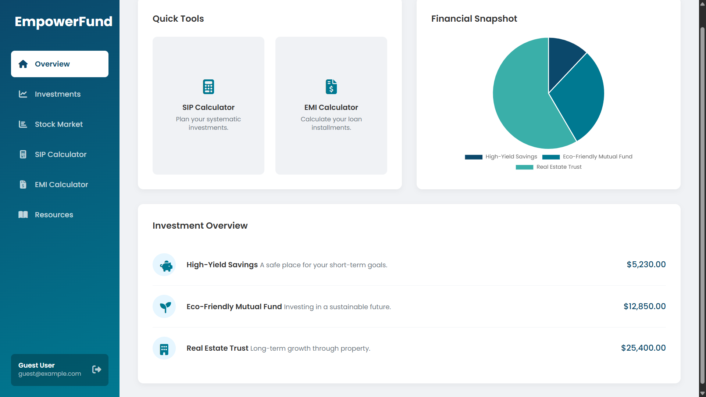
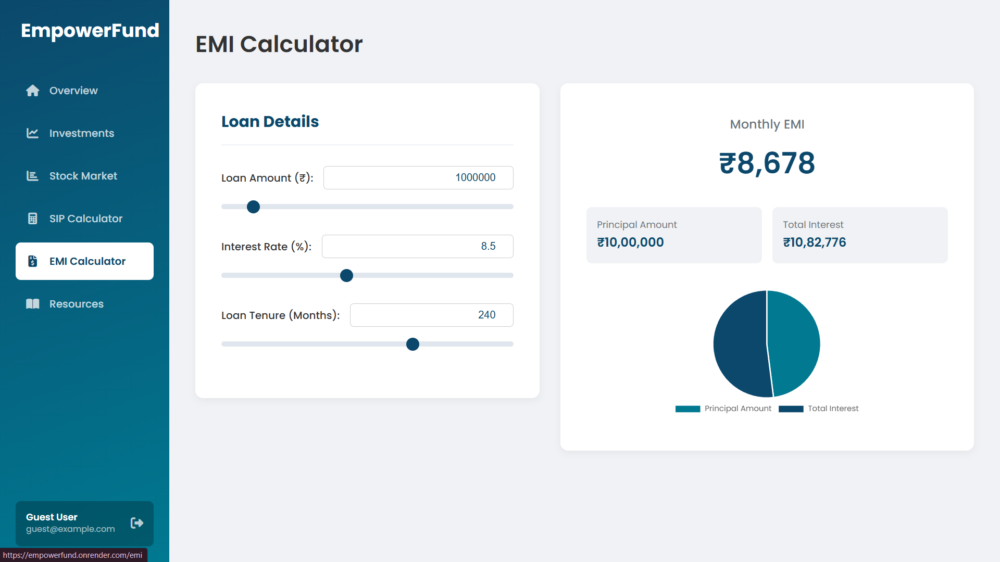
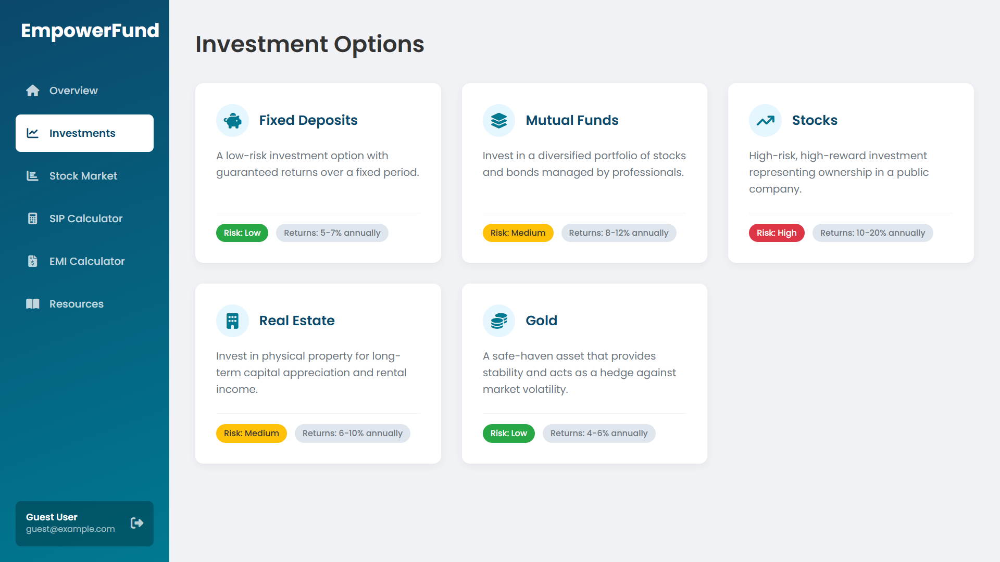
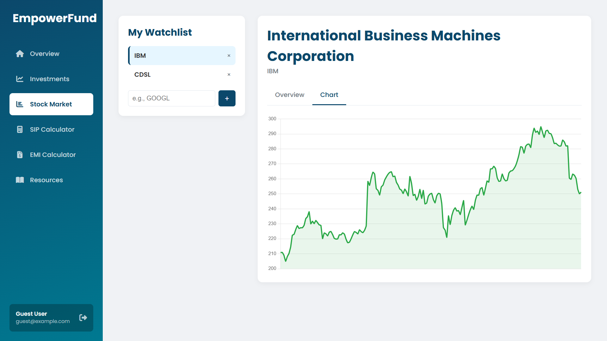
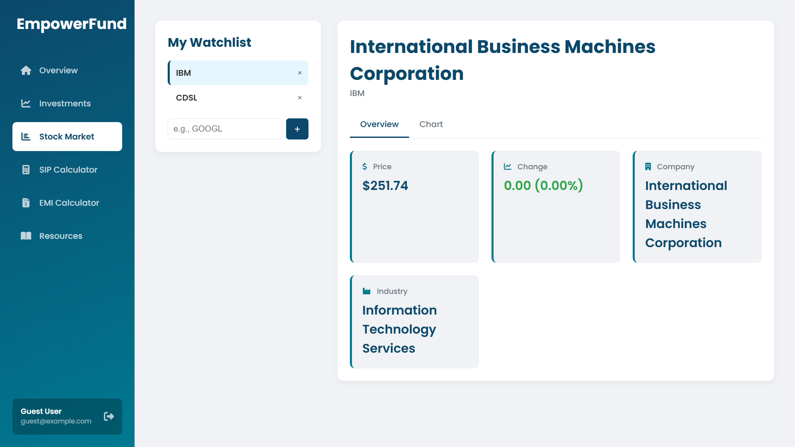

# EmpowerFund: Personal Finance Dashboard

EmpowerFund is a modern, all-in-one web application designed to help users take control of their financial future. It provides a suite of interactive tools, a personalized dashboard, and real-time market data to support users in setting and tracking their financial goals.

## ✨ Key Features

- **Modern User Dashboard:** A clean, professional interface that gives users a snapshot of their financial world, including an interactive portfolio chart.
- **Interactive Financial Calculators:**
    - **SIP Calculator:** An intuitive tool with sliders and an instant-results bar chart to visualize the growth of systematic investment plans.
    - **EMI Calculator:** A user-friendly calculator with synchronized sliders and input fields, complete with a pie chart to break down loan components.
- **Live Stock Market Watchlist:** A personalized hub for tracking stocks. Users can add and remove symbols from their watchlist to view real-time price data, company profiles, and interactive charts, all powered by the **Financial Modeling Prep (FMP) API**.
- **Investment Learning Module:** A curated list of common investment options, complete with descriptions, risk levels, and expected returns to educate users.
- **Secure User Authentication:** A complete authentication system for user registration and login, secured with Passport.js and password hashing.
- **Optimized Performance:** Features a server-side, in-memory caching system that dramatically reduces API usage and improves response times for frequently accessed stock data.

## 🛠️ Technologies Used

| Category      | Technology                                        |
| :------------ | :------------------------------------------------ |
| **Backend** | Node.js, Express, MongoDB, Mongoose, Passport.js, EJS |
| **Frontend** | HTML5, CSS3, JavaScript, Chart.js                 |
| **APIs** | Financial Modeling Prep (FMP) API                 |
| **Dev Tools** | Git, VS Code, npm                                 |

## 🚀 Getting Started

Follow these instructions to get a copy of the project up and running on your local machine.

### Prerequisites

- Node.js and npm installed
- MongoDB database (you can use a free cloud instance from MongoDB Atlas)
- A free API key from [Financial Modeling Prep](https://site.financialmodelingprep.com/developer/docs/)

### Installation

1.  **Clone the repository:**
    ```sh
    git clone [https://github.com/your-username/empowerfund.git](https://github.com/your-username/empowerfund.git)
    cd empowerfund
    ```

2.  **Install NPM packages:**
    ```sh
    npm install
    ```

3.  **Create and configure your environment file:**
    Create a file named `.env` in the root directory of the project and add the following variables:
    ```
    MONGO_URI=your_mongodb_connection_string
    SESSION_SECRET=a_strong_secret_key_for_sessions
    FMP_API_KEY=your_financial_modeling_prep_api_key
    PORT=5000
    ```

4.  **Run the server:**
    ```sh
    npm start
    ```
    The application will be running at `http://localhost:5000`.

### Guest Login

For quick access and demonstration, you can use the following guest credentials on the login page:
- **Email:** `guest@example.com`
- **Password:** `guest123`

## 📸 Screenshots

| Login Page | Dashboard |
| :---: | :---: |
|  |  |
| **SIP Calculator** | **EMI Calculator** |
|  |  |
| **Investment Options** | **Stock Market (Watchlist)** |
|  |  |
| **Stock Market (Details)** |
|  |

---
