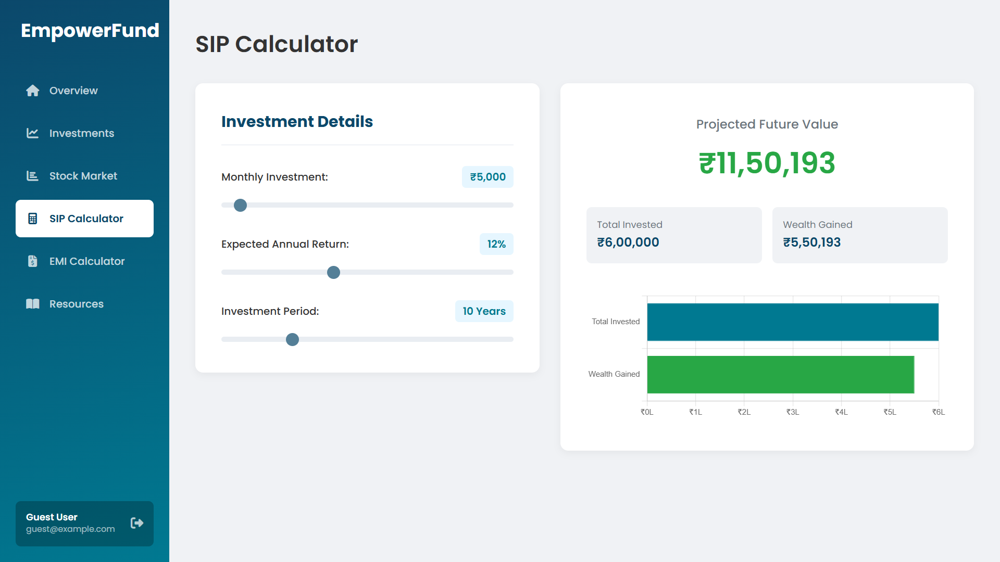

# EmpowerFund: A Modern Personal Finance Dashboard

EmpowerFund is a dynamic, full-stack web application designed to provide users with a comprehensive and intuitive platform for managing their financial life. It features a suite of interactive calculators, a personalized stock watchlist powered by a live financial data API, and a clean, modern user dashboard.

**[➡️ Live check here ](https://empowerfund.onrender.com/)**

---

## ✨ Core Features

* **Professional User Dashboard:** A central hub providing a snapshot of the user's financial world, featuring an interactive portfolio distribution chart to visualize assets.
* **Interactive Financial Calculators:**
    * **SIP Calculator:** A dynamic tool with synchronized sliders and a real-time results chart, allowing users to intuitively understand the power of systematic investment plans.
    * **EMI Calculator:** A user-friendly calculator with both sliders and precise input fields, complete with a pie chart that visually breaks down principal vs. interest payments.
* **Live Stock Market Watchlist:** A personalized stock tracking module powered by the **Financial Modeling Prep (FMP) API**. Users can add/remove stocks to a persistent watchlist and view detailed company profiles and interactive price charts.
* **Performance Optimization:** Features a robust server-side caching mechanism (`node-cache`) that stores API results for 15 minutes, drastically reducing redundant API calls and improving data retrieval times for frequently viewed stocks.
* **Secure Authentication:** Full user registration and login functionality using Passport.js, with password hashing (`bcrypt.js`) to ensure user data is secure.

## 🛠️ Tech Stack & Architecture

This project is built on a classic Model-View-Controller (MVC) architecture, utilizing Node.js and Express on the backend.

      

## 🚀 Getting Started

### Prerequisites

* Node.js and npm
* MongoDB (local or cloud instance via Atlas)
* A free API key from [Financial Modeling Prep](https://site.financialmodelingprep.com/developer/docs/)

### Installation & Setup

1.  **Clone the Repository**
    ```sh
    git clone [https://github.com/your-username/empowerfund.git](https://github.com/your-username/empowerfund.git)
    cd empowerfund
    ```

2.  **Install Dependencies**
    ```sh
    npm install
    ```

3.  **Configure Environment Variables**
    Create a `.env` file in the project root and add the following:
    ```
    MONGO_URI=your_mongodb_connection_string
    SESSION_SECRET=your_strong_session_secret
    FMP_API_KEY=your_financial_modeling_prep_api_key
    PORT=5000
    ```

4.  **Run the Server**
    ```sh
    npm start
    ```
    The application will be available at `http://localhost:5000`.

### Guest Login

For demonstration purposes, use the following credentials:
* **Email:** `guest@example.com`
* **Password:** `guest123`

## 📸 Application Screenshots

| Login Page | Dashboard |
| :---: | :---: |
|  |  |
| **SIP Calculator** | **EMI Calculator** |
|  |  |
| **Investment Options** | **Stock Market (Watchlist)** |
|  |  |
| **Stock Market (Details)** |
|  |

---
